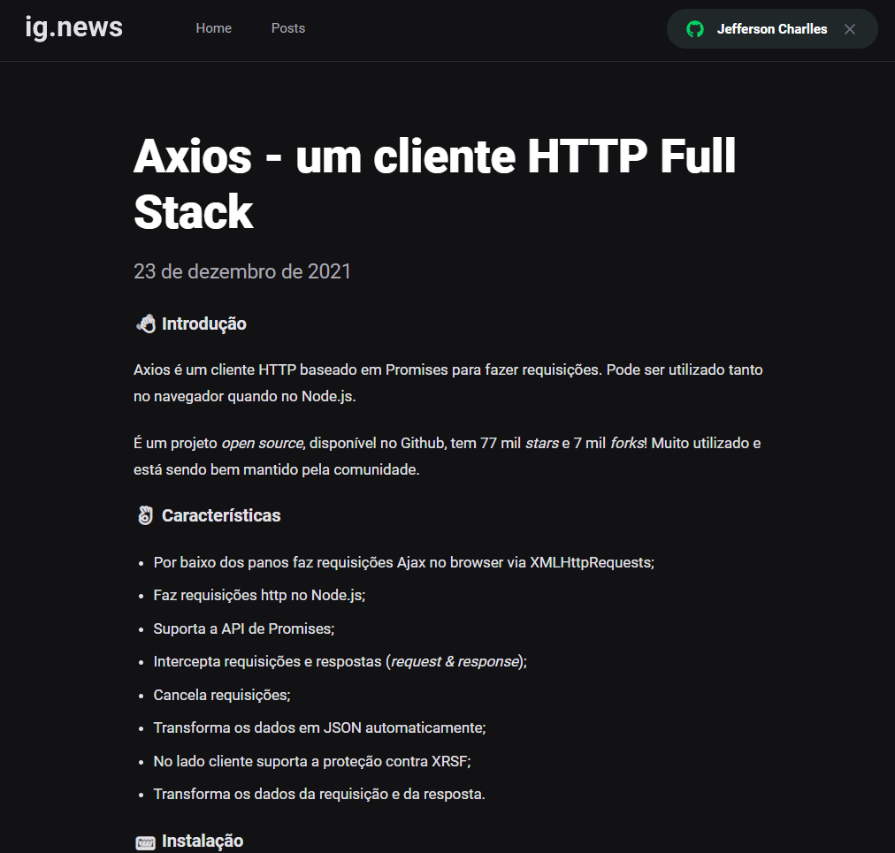
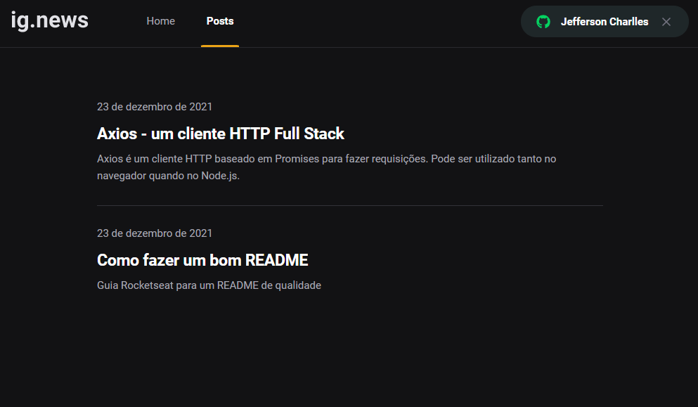

<div align="center">
  <a href="https://opensource.org/licenses/MIT"></a>
</div>

<p align="center">
  <a href="#interrobang-what-is-inter">About</a>&nbsp;&nbsp;&nbsp;|&nbsp;&nbsp;&nbsp;
  <a href="#technologies">Technologies used</a>&nbsp;&nbsp;&nbsp;|&nbsp;&nbsp;&nbsp;
  <a href="#construction_worker-how-to-use-developing">How to portfolio</a>&nbsp;&nbsp;&nbsp;|&nbsp;&nbsp;&nbsp;
  <a href="#key-license">License</a>
</p>

<h1 align='center'>
  
  
  
</h1>

## Getting Started IgNews

First, run the development server:

```bash
npm run dev
# or
yarn dev
```

